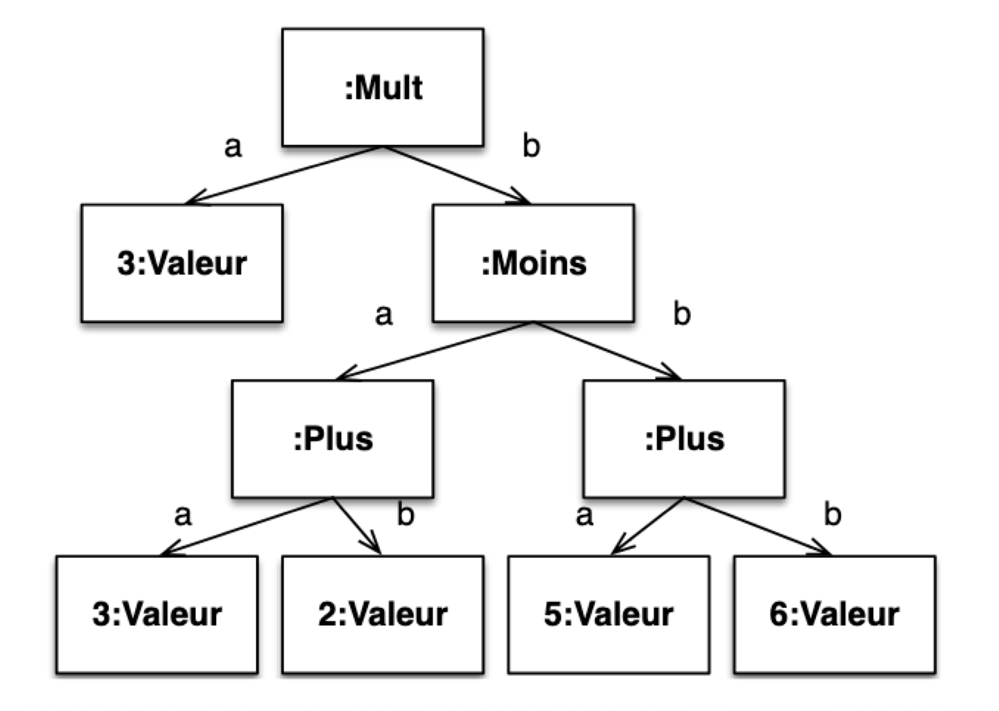

# OperationsMath

Implémnetation d'un coposite et d'un visitor.

## Contexte

L'objectif est de représenter des opérations mathématiques simples (addition, soustraction, multiplication, division) et composées (une opération composée est une opération qui contient d'autres opérations).

Exemple d'opération composée : 

Dans un second temps, il faudra être capable d'afficher ces opérations sous différentes formes textuelles.

Exemple de représentation textuelles pour l'opération composée ci-dessus :
- Forme infixée : (3 * ((3 + 2) - (5 + 6)))
- Forme préfixée : * 3 - + 3 2 + 5 6
- Forme LaTeX : \left( 3 \times \left( \left( 3 + 2 \right) - \left( 5 + 6 \right) \right) \right)

## Problématique

Comment représenter des opérations mathématiques simples et composées de manière modulaire et extensible ?

Comment ajouter de nouvelles opérations ou de nouvelles représentations textuelles sans avoir à modifier le code existant ?

